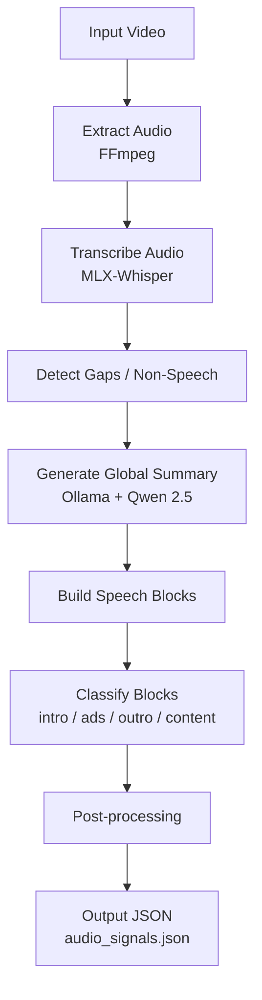

# Audio Algorithmic Flow

High-level Mermaid diagram for the audio pipeline.

---

## 1. Audio pipeline

```mermaid
flowchart TD
    A[Input Video] --> B[Extract Audio<br/>FFmpeg]
    B --> C[Transcribe Audio<br/>MLX-Whisper]
    C --> D[Detect Gaps / Non-Speech]
    D --> E[Generate Global Summary<br/>Ollama + Qwen 2.5]
    E --> F[Build Speech Blocks]
    F --> G[Classify Blocks<br/>intro / ads / outro / content]
    G --> H[Post-processing]
    H --> I[Output JSON<br/>audio_signals.json]
```

Final labels: `intro`, `content`, `ads`, `outro`, `transition`
