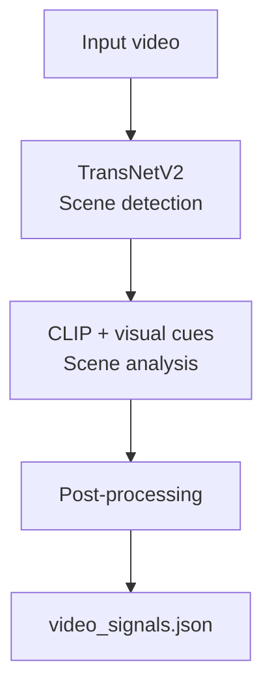
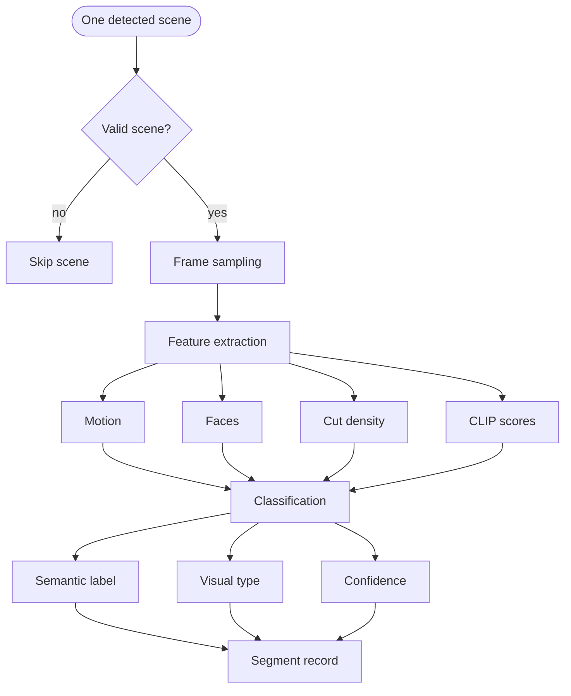
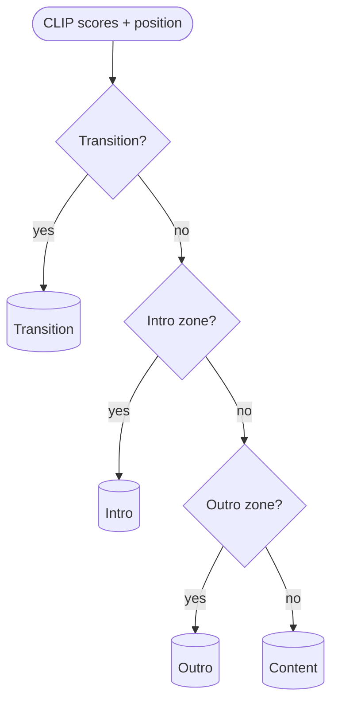
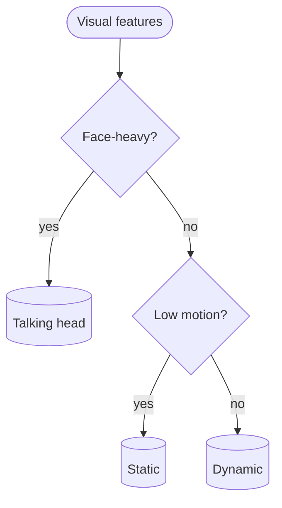
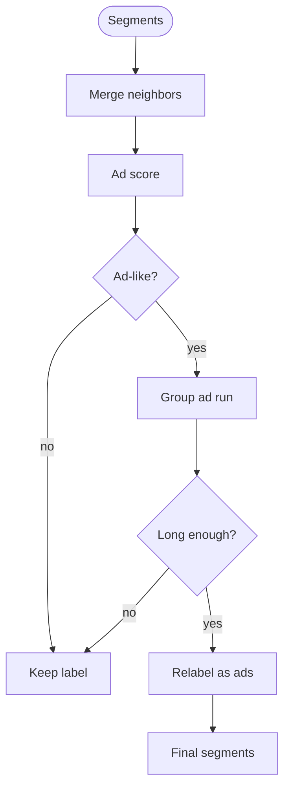
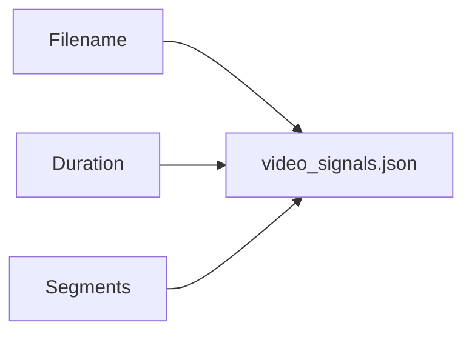
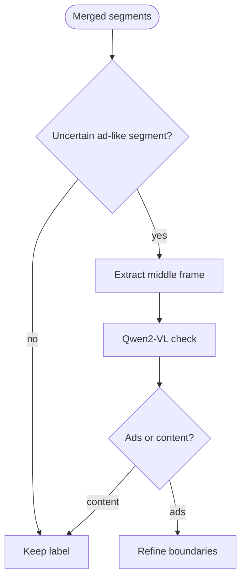

# Video Algorithmic Flow

High-level Mermaid diagrams for `video.py`.
Six views, from the full pipeline down to ad-detection refinement.

---

## 1. Top-level pipeline

---

## 2. Per-scene analysis

---

## 3. Semantic classification router

---

## 4. Visual type decision

---

## 5. Ad detection and temporal merge

---

## 6. Output structure

---

## Constants quick reference

| Constant / threshold | Value | Where |
|---|---:|---|
| Minimum scene duration | `1.0s` | Drop very short scenes before analysis |
| Sampled frames per scene | `6` | Frame sampling |
| Motion thresholds | `<5 low`, `<20 medium`, otherwise high | `compute_motion` |
| Intro gate | `clip intro > 0.4` and `position < 0.2` | Semantic router |
| Outro gate | `clip outro > 0.4` and `position > 0.8` | Semantic router |
| Talking-head gate | `face_ratio > 0.6` and `cut_density < 0.5` | Visual type |
| Static gate | `motion low` and `face_ratio < 0.3` | Visual type |
| Merge gap | `< 1.0s` | `merge_segments` |
| Ad-candidate gate | `ad_score > 0.6` | Ad scoring |
| Ad-run minimum | `> 5s` | `merge_ad_segments` |

---

## VLM attempt

In `video_vLLM.py`, we also tried adding a VLM-based verification step after the CLIP + heuristic ad-detection pass.

This VLM branch can improve ad detection on ambiguous segments, but it is much slower than the CLIP-based pipeline.
