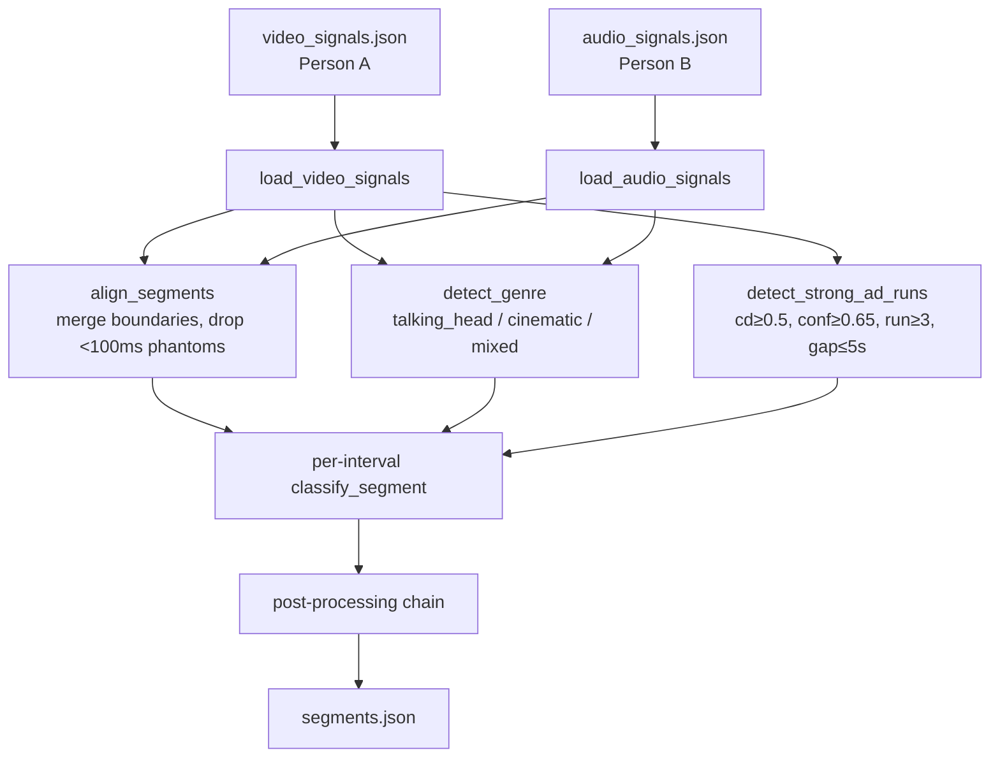
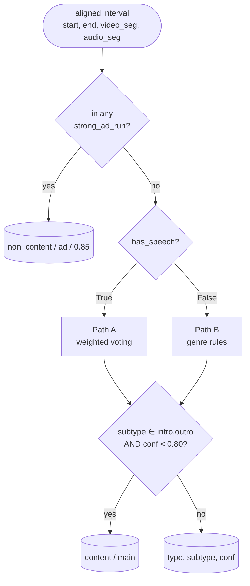
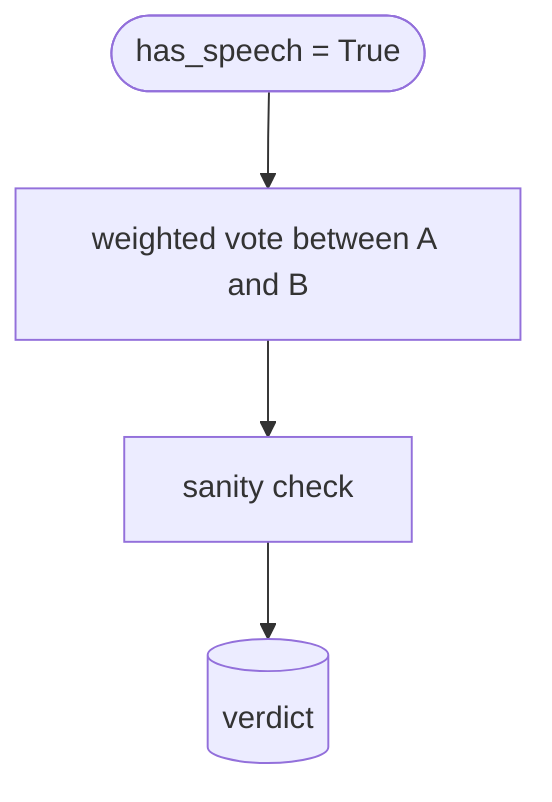
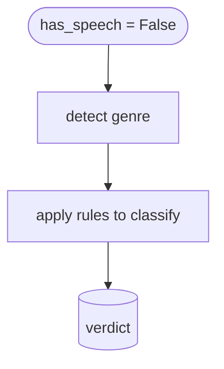

# Integrator Algorithmic Flow

High-level Mermaid diagrams for [backend/integrator.py](../../backend/integrator.py).
Five views, in increasing zoom level.

---

## 1. Top-level pipeline

---

## 2. classify_segment — router

---

## 3. Path A — speech present

---

## 4. Path B — no speech

---

## 5. Post-processing chain — `generate_output`

---

## Constants quick reference

| Constant | Value | Where |
|---|---|---|
| `BASE_W_A` / `BASE_W_B` | 0.4 / 0.6 | Path A weighted vote |
| `INTRO_WINDOW_SECONDS` / `OUTRO_WINDOW_SECONDS` | 90.0 | zone gates |
| `INTRO_OUTRO_MIN_CONF` | 0.80 | router exit gate |
| `MIN_INTERVAL_DURATION` | 0.1 | alignment phantom filter |
| `STRONG_AD_*` | cd&ge;0.5, conf&ge;0.65, run&ge;3, gap&le;5s, override=0.85 | Step 0 override |
| `WINDOW_SHORT_DURATION` / `WINDOW_MIN_FRAGMENTS` | 30.0 / 3 | post-processing collapser |
