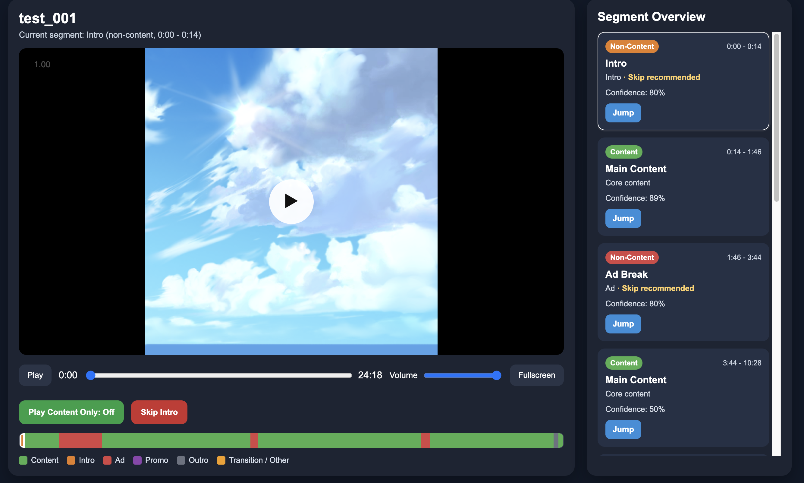
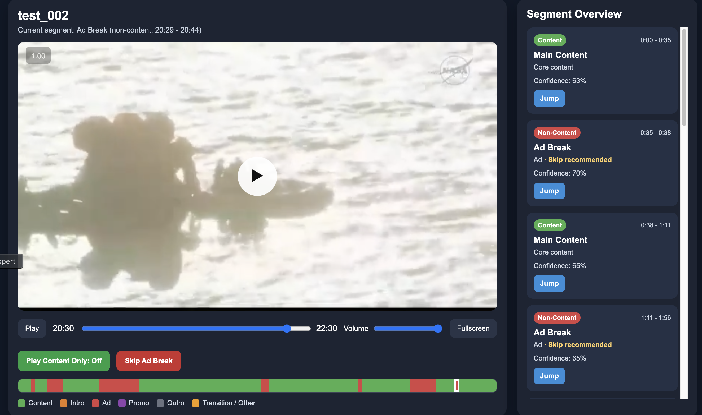
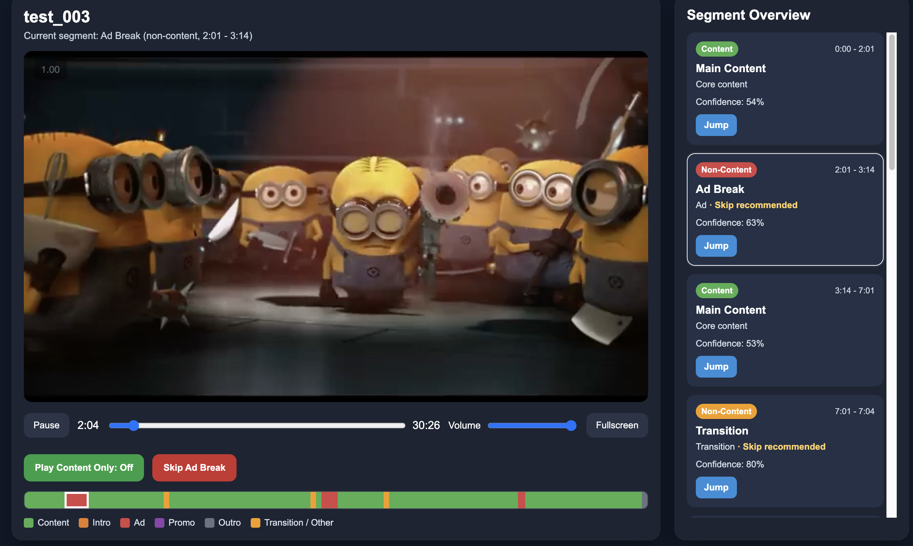
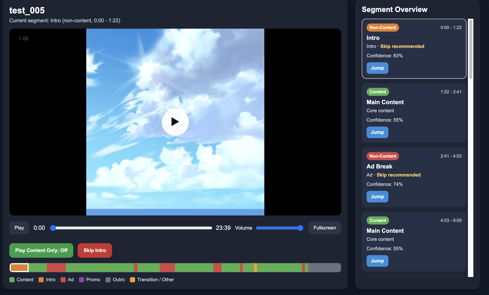

# Week 2 Pipeline Report

> Generated 2026-05-04. Five test videos evaluated end-to-end (test_001 – test_005).

---

## 1. What Was Done — Person C (`backend/integrator.py`)

Final fusion architecture:

```
classify_segment router
    ├── strong_ad_runs override         ← pre-classification
    └── fork on has_speech
        ├── True  → Path A (weighted vote)
        └── False → Path B (genre + has_face rules)
```

**Week 2 v2 base (carried over from prior commits):**
- Dual-path classification (Path A on speech, Path B on no-speech).
- Weighted voting between A (visual) and B (audio) with per-label context multipliers.
- Genre detection per video (`talking_head | cinematic | mixed`) drives Path B rules.
- Position-zone constraints: intro/outro only valid in outer 90 s of the video.
- Sliding-window collapser for fragmented short-segment regions.

**Week 2 stabilization (this session):**

| Modification | Reason |
|---|---|
| **Strong-ad-run override** — promote a segment to `ad` whenever it lies inside a run of ≥3 consecutive A-labeled `ads` segments with `cut_density ≥ 0.5` and `confidence ≥ 0.65` | A's per-segment ads label is noisy, but consecutive runs with high cut density and confidence are reliable signals for real ad blocks |
| **Exclude `cinematic` genre from the music ≥10 s → ad rule in Path B** | The rule was generating long false positives in score-heavy content where music is normal background, not a sponsorship marker |
| **Path A: discard B's `intro` / `outro` labels when `has_speech=True`** | The audio LLM systematically over-extends intro / outro into spoken content (test_001 80 s of speech labeled intro, test_004 74 s, test_003 44 s of dialogue labeled intro). Real intros/outros are visual title/credit cards, not spoken introductions |
| **Path B: intro / outro now require `(in zone + has_face != True)`, audio type irrelevant** | The previous music-only rule missed silent buffers (test_004 4.8 s opening silence) and also let presenter-on-screen shots be misclassified |
| **Wired `cut_density` into the `VideoSegment` dataclass and JSON loader** | Required by the strong-ad-run filter |

---

## 2. Visual Results — Frontend Output per Test

Each screenshot shows the segmented timeline rendered in the frontend, with per-segment classification (intro / content / ad / outro / transition) and skip controls.

### test_001 — TED talk (talking_head)



### test_002 — Lecture with B-roll (mixed)



### test_003 — Animation: Minions (cinematic)



### test_004 — CS230 lecture (talking_head)


### test_005 — Documentary (cinematic)



---

## 3. Calibration Constants (Integrator)

For reference / future tuning:

```python
BASE_W_A = 0.4          # visual modality weight
BASE_W_B = 0.6          # audio/semantic modality weight
CTX_W_A  = {intro:1.3, outro:1.3, ads:0.5, content:1.0, transition:0.8}
CTX_W_B  = {intro:1.0, outro:1.0, ads:1.4, content:0.9, transition:1.1}

INTRO_WINDOW_SECONDS    = 90.0
OUTRO_WINDOW_SECONDS    = 90.0
INTRO_OUTRO_MIN_CONF    = 0.80

STRONG_AD_MIN_CUT_DENSITY = 0.5
STRONG_AD_MIN_CONFIDENCE  = 0.65
STRONG_AD_MIN_RUN         = 3
STRONG_AD_MAX_GAP         = 5.0
STRONG_AD_OVERRIDE_CONF   = 0.85
```

---

## 4. Outstanding Issues

| Issue | Detail |
|---|---|
| **Ad boundary not precise** | Detected ad ranges often over-extend into adjacent content or under-cover the true ad span. Driven by both modalities producing approximate boundaries that the integrator inherits |
| **Short ads false positive** | Long content segments with brief music or rapid cuts can produce isolated short `ad` predictions sandwiched by content. Sliding window only collapses fragmented runs, not isolated long FPs |
| **Animation not precise** | `cinematic` genre rules and visual signals (CLIP / cut density / face detection) are not well-tuned for animated content; precision and recall both suffer on animation tests |

---

## 5. Demo Readiness

- ✅ End-to-end pipeline runs on all 5 test videos.
- ✅ Frontend renders segment timeline with skip controls.
- ✅ Intro / outro / ad / content / transition all classified per segment.

Demo date: **May 6 – 8, 2026**.
